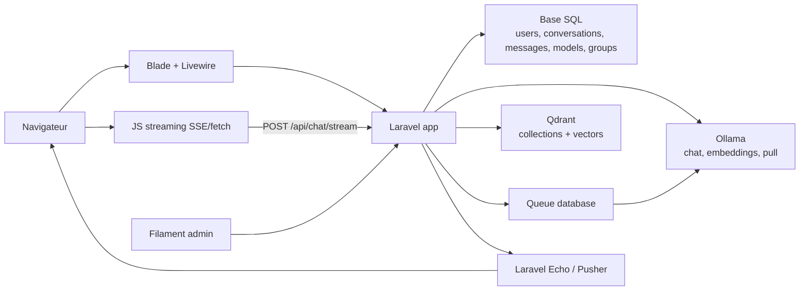

# TinyTalkAI - Description, architecture et cartographie technique

Ce document décrit l'etat actuel du projet TinyTalkAI tel qu'il apparait dans le code. Il complete le `README.md` avec une vision plus operationnelle : architecture, stack, flux principaux et correspondance entre fonctionnalites et fichiers.

## Description du projet

TinyTalkAI est une application Laravel auto-hebergee qui fournit une interface de chat pour interroger des modeles LLM executes localement via Ollama. L'application ajoute une couche d'authentification, de persistance des conversations, de gestion des modeles disponibles, de controle d'acces par groupes, et un mode RAG base sur des documents indexes dans Qdrant.

Les utilisateurs interagissent principalement avec une page de chat protegee. Les administrateurs disposent d'un back-office Filament pour gerer les utilisateurs, roles, groupes, modeles, collections documentaires et modeles d'embedding.

## Stack technique

### Backend

- PHP `^8.2`
- Laravel `^12.0`
- Livewire `^3.4`
- Livewire Volt `^1.7`
- Laravel Breeze pour l'authentification
- Filament `^3.0` pour l'administration
- Spatie Laravel Permission `^6.21` pour les roles et permissions
- Laravel Queue avec driver `database` par defaut
- Laravel Echo + Pusher pour les notifications temps reel cote navigateur

### IA et RAG

- Ollama pour les modeles LLM et embeddings
- API Ollama `/api/chat`, `/api/tags`, `/api/show`, `/api/embeddings`, `/api/pull`
- Qdrant pour le stockage vectoriel et la recherche de similarite
- `smalot/pdfparser` pour extraire le texte des PDF
- `phpoffice/phpword` pour extraire le texte des DOCX/DOC

### Frontend

- Blade
- Livewire
- Alpine.js
- Tailwind CSS `^3.4`
- Vite `^6.2`
- Axios
- Pusher JS / Laravel Echo

### Infrastructure locale

- Laravel Sail
- MySQL 8
- Redis
- Qdrant
- PostgreSQL avec pgvector est declare dans `docker-compose.yml`, meme si le code RAG utilise Qdrant.
- Un worker queue dedie est declare dans `docker-compose.yml`.

## Architecture globale



## Structure des dossiers importants

| Dossier | Role |
| --- | --- |
| `app/Livewire` | Composants interactifs du chat, selection de modele, collections, RAG, historique, upload documents |
| `app/Http/Controllers` | Controleurs HTTP, notamment le streaming chat vers Ollama |
| `app/Services` | Logique metier IA/RAG, synchronisation Ollama, memoire conversationnelle, Qdrant |
| `app/Models` | Modeles Eloquent et relations |
| `app/Filament` | Back-office admin : resources, pages, widgets |
| `app/Events` | Evenements broadcast pour rafraichir modeles, collections et groupes |
| `app/Jobs` | Jobs asynchrones, notamment installation de modeles Ollama |
| `database/migrations` | Schema relationnel |
| `resources/views` | Vues Blade, composants Blade et templates Livewire |
| `resources/js` | Bootstrap frontend, Echo, Pusher |
| `public/js/chat.js` | Abonnements Echo publics pour rafraichir Livewire |
| `routes` | Routes web, auth et console |
| `scripts` | Scripts de setup Ollama / Filament |
| `docs` | Documentation projet |

## Flux principal de chat

1. `routes/web.php` expose `/` vers `resources/views/chat.blade.php`, avec middleware `auth` et `verified`.
2. `resources/views/chat.blade.php` charge la sidebar et `x-chat-interface`.
3. `resources/views/components/chat-interface.blade.php` monte les composants Livewire `chat-messages`, `chat-form`, `token-counter` et `rag-toggle`.
4. `app/Livewire/ChatForm.php` valide le message, cree ou recharge une conversation, persiste le message utilisateur et prepare le contexte.
5. Si RAG est actif, `ChatForm` appelle `app/Services/RagService.php` pour rechercher les documents pertinents dans Qdrant.
6. `ChatForm` emet l'evenement Livewire `startStreaming`.
7. Le JavaScript dans `resources/views/components/chat-interface.blade.php` envoie un `POST /api/chat/stream`.
8. `app/Http/Controllers/ChatStreamController.php` appelle Ollama `/api/chat` en streaming et renvoie des evenements SSE.
9. Le navigateur affiche les chunks au fil de l'eau, puis reinjecte le message final dans Livewire.
10. `ChatStreamController` persiste le message assistant et incremente les tokens de la conversation.

## Flux RAG et documents

Le RAG existe sous deux formes :

- RAG par conversation : un document est attache a une conversation via `conversation_documents`.
- RAG par collection : l'utilisateur selectionne une collection Qdrant accessible.

Flux d'indexation :

1. Upload d'un fichier `.txt`, `.pdf` ou `.docx`.
2. Extraction de texte via `Storage`, `smalot/pdfparser` ou `phpoffice/phpword`.
3. Decoupage en chunks dans `RagService::chunkText`.
4. Generation d'embeddings via Ollama `/api/embeddings`.
5. Creation/verif de collection Qdrant.
6. Upsert des points vectoriels dans Qdrant.
7. Pour les documents de conversation, association via `ConversationDocument`.

Flux de recherche :

1. La question utilisateur est convertie en embedding.
2. `RagService::searchSimilarDocuments` interroge Qdrant `/points/search`.
3. Les resultats au-dessus du seuil de score sont injectes dans un prompt systeme.
4. Le prompt enrichi est envoye a Ollama avec l'historique local.

## Memoire conversationnelle

`app/Services/ConversationMemoryService.php` gere :

- la fenetre locale des messages depuis le dernier resume ;
- le resume de conversation stocke dans `conversations.summary` ;
- la decision de resumer quand l'utilisation de tokens atteint 90 % de la limite ;
- la generation d'un resume via Ollama.

Le compteur visible est gere par `app/Livewire/TokenCounter.php`, qui recupere aussi la limite de contexte du modele via Ollama `/api/show`.

## Administration

Le panel Filament est configure dans `app/Providers/Filament/AdminPanelProvider.php` et disponible sur `/admin`.

L'acces au panel est limite par `App\Models\User::canAccessPanel`, qui verifie le role `admin`.

Resources principales :

| Resource | Fichier | Role |
| --- | --- | --- |
| Utilisateurs | `app/Filament/Resources/UserResource.php` | Gestion utilisateurs, roles et groupes |
| Roles | `app/Filament/Resources/RoleResource.php` | Gestion roles et permissions Spatie |
| Groupes | `app/Filament/Resources/GroupResource.php` | Association groupes-modeles-collections |
| Collections | `app/Filament/Resources/CollectionResource.php` | Gestion collections documentaires et groupes autorises |
| Modeles IA | `app/Filament/Resources/AIModelResource.php` | Liste/synchronisation des modeles Ollama, activation, famille `llm`/`embedding` |
| Modeles d'embedding | `app/Filament/Resources/EmbeddingModelResource.php` | Selection du modele d'embedding actif |
| Installations | `app/Filament/Widgets/ModelInstallationsWidget.php` | Suivi des telechargements de modeles |

## Controle d'acces

Le projet combine deux niveaux :

- Roles Spatie : gerent notamment l'acces admin.
- Groupes applicatifs : filtrent l'acces aux modeles IA et aux collections RAG.

Fichiers concernes :

- `app/Models/User.php`
- `app/Models/Group.php`
- `app/Models/AIModel.php`
- `app/Models/Collection.php`
- `database/migrations/2025_08_18_132434_create_group_user_table.php`
- `database/migrations/2025_08_26_create_model_group_table.php`
- `database/migrations/2025_08_19_000001_create_collections_table.php`
- `app/Livewire/ModelSelector.php`
- `app/Livewire/Collection.php`

## Temps reel et rafraichissements UI

Les changements admin declenchent des evenements broadcast :

| Evenement | Fichier | Canal | Effet cote navigateur |
| --- | --- | --- | --- |
| Collection creee/modifiee/supprimee | `app/Events/CollectionChanged.php` | `collections` | `refreshCollections` Livewire |
| Association collection-groupe | `app/Events/CollectionGroupChanged.php` | `collections` | `refreshCollections` Livewire |
| Association modele-groupe | `app/Events/ModelGroupChanged.php` | `models` | `refreshModels` Livewire |
| Association utilisateur-groupe | `app/Events/UserGroupChanged.php` | `users` | `refreshModels` et `refreshCollections` |

Le bootstrap Echo est dans `resources/js/bootstrap.js`. Les abonnements qui dispatchent les evenements Livewire sont dans `public/js/chat.js`.

## Cartographie fonctionnalites -> fichiers

| Fonctionnalite | Fichiers principaux |
| --- | --- |
| Page de chat | `routes/web.php`, `resources/views/chat.blade.php`, `resources/views/components/chat-interface.blade.php` |
| Layout sidebar | `resources/views/components/sidebar.blade.php`, `resources/views/components/application-logo.blade.php` |
| Affichage messages | `app/Livewire/ChatMessages.php`, `resources/views/livewire/chat-messages.blade.php`, `resources/views/components/chat-interface.blade.php` |
| Envoi message | `app/Livewire/ChatForm.php`, `resources/views/livewire/chat-form.blade.php` |
| Streaming Ollama | `app/Http/Controllers/ChatStreamController.php`, `resources/views/components/chat-interface.blade.php` |
| Persistance conversations/messages | `app/Models/Conversation.php`, `app/Models/Message.php`, migrations `conversations` et `messages` |
| Historique conversations | `app/Livewire/ConversationHistory.php`, `resources/views/livewire/conversation-history.blade.php` |
| Selection modele | `app/Livewire/ModelSelector.php`, `resources/views/livewire/model-selector.blade.php`, `app/Models/AIModel.php` |
| Synchronisation modeles Ollama | `app/Services/ModelSyncService.php`, `app/Console/Commands/SyncModels.php`, `app/Filament/Resources/AIModelResource.php` |
| Installation modele Ollama | `app/Jobs/InstallOllamaModel.php`, `app/Models/ModelInstallation.php`, `app/Filament/Widgets/ModelInstallationsWidget.php` |
| Compteur tokens | `app/Livewire/TokenCounter.php`, `resources/views/livewire/token-counter.blade.php`, `app/Services/ConversationMemoryService.php` |
| Resume conversation | `app/Services/ConversationMemoryService.php`, `app/Livewire/TokenCounter.php`, migration `2025_07_29_add_summary_fields_to_conversations_table.php` |
| Toggle RAG | `app/Livewire/RagToggle.php`, `resources/views/livewire/rag-toggle.blade.php`, `app/Livewire/ChatForm.php` |
| Upload document conversation | `app/Livewire/DocumentUploader.php`, `resources/views/livewire/document-uploader.blade.php`, `app/Models/ConversationDocument.php` |
| Collections RAG utilisateur | `app/Livewire/Collection.php`, `resources/views/livewire/collection.blade.php`, `app/Models/Collection.php` |
| Traitement RAG | `app/Services/RagService.php`, `app/Services/QdrantCollectionsService.php` |
| Modeles d'embedding | `app/Models/EmbeddingModel.php`, `app/Filament/Resources/EmbeddingModelResource.php`, `app/Services/RagService.php` |
| Admin Filament | `app/Providers/Filament/AdminPanelProvider.php`, `app/Filament/Resources/*` |
| Authentification | `routes/auth.php`, `app/Livewire/Forms/LoginForm.php`, `resources/views/livewire/pages/auth/*`, tests `tests/Feature/Auth/*` |
| Profil utilisateur | `routes/web.php`, `resources/views/profile.blade.php`, `resources/views/livewire/profile/*` |
| Localisation FR/EN | `app/Http/Middleware/SetLocale.php`, `resources/lang/fr.json`, `resources/lang/en.json`, route `/locale` dans `routes/web.php` |
| Theme clair/sombre | `resources/views/chat.blade.php`, `tailwind.config.js`, `resources/css/app.css` |
| Broadcast/Echo | `app/Events/*`, `resources/js/bootstrap.js`, `public/js/chat.js`, `config/broadcasting.php` |
| Docker/Sail | `docker-compose.yml`, `composer.json`, scripts `scripts/*` |

## Schema de donnees principal

| Table | Usage |
| --- | --- |
| `users` | Comptes applicatifs |
| `roles`, `permissions`, pivots Spatie | Roles et permissions |
| `groups` | Groupes metier pour filtrer modeles et collections |
| `group_user` | Association utilisateurs-groupes |
| `models` | Modeles Ollama synchronises, avec famille `llm` ou `embedding` |
| `model_group` | Modeles accessibles par groupe |
| `embedding_models` | Modele d'embedding actif |
| `collections` | Collections documentaires declarees en base |
| `collection_group` | Collections accessibles par groupe |
| `conversations` | Conversations utilisateur, modele, tokens, resume |
| `messages` | Messages user/assistant et settings d'appel |
| `conversation_documents` | Documents indexes lies a une conversation |
| `model_installations` | Suivi des installations Ollama |
| `jobs`, `failed_jobs`, `job_batches` | Queue Laravel |
| `notifications` | Notifications Filament/database |

## Points d'attention constates

- Le README mentionne un historique chiffre "a venir". Dans le code actuel, les messages sont persistants en clair dans `messages.content`.
- `ChatStreamController::extractTokensFromLastResponse()` retourne actuellement `0`, alors que `handleFinalResponse()` calcule des tokens pour la persistance.
- `ChatStreamController::updateAssistantMessageInDatabase()` est un stub ; le message assistant est cree a la fin du stream.
- `config/services.php` ne declare que `ollama`. Les services lisent aussi `services.qdrant.*` avec des valeurs par defaut, mais aucune configuration Qdrant centralisee n'est presente dans ce fichier.
- `docker-compose.yml` declare MySQL et PostgreSQL avec le meme `FORWARD_DB_PORT` par defaut, ce qui peut provoquer un conflit de ports si les deux sont exposes simultanement sans variables d'environnement adaptees.

## Commandes utiles

```bash
composer dev
composer test
npm run dev
npm run build
php artisan models:sync
php artisan models:sync --deactivate-missing
php artisan queue:work
```

Avec Sail :

```bash
./vendor/bin/sail up -d
./vendor/bin/sail artisan migrate --seed
./vendor/bin/sail artisan models:sync
./vendor/bin/sail artisan queue:work
```
